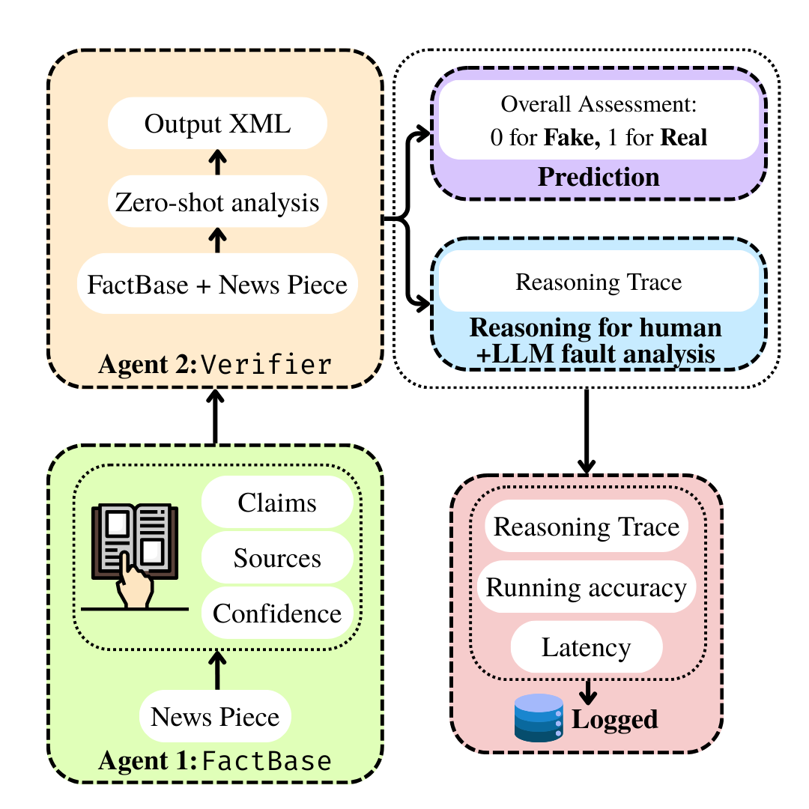

# 2-agent Fake News Detection Framework

- **Agent 1**: Take the input news piece and get a list of relevant facts
- **Agent 2**: Reason with the input and the list of facts to decide whether news piece is fake

## Agent 1: FactBase

1. We will use Gemini 1.5 Pro's better language understanding and enhanced knowledge base to extract facts and sources from the news source.
2. The facts will be returned as CSV, which will then be passed to Agent 2

## Agent 2: Verifier

1. We will use the new Gemini 2.0 Flash model with zero-shot reasoning to get the final response: fake news or not.
2. The final answer needs be returned in an XML format. This helps in easy integration with an existing code base.

# Results

| Model              | Training Time | VRAM   | Accuracy | Model Size |
|--------------------|--------------|--------|----------|------------|
| 2-agent framework | N/A          | N/A     | 72.86%   | N/A        |
| 3-agent framework | N/A          | N/A     | 57.40%   | N/A        |
| Zero-shot Gemini 1.5 Pro | N/A          | N/A     | 68.79%   | N/A        |
| Zero-shot Gemini 2.0 Flash | N/A          | N/A     | 72.69%   | N/A        |
| DistilBERT        | 43.5s        | 1.1 GB  | 72.00%   | 66M        |
| TinyBERT          | 4.6s         | 0.2 GB  | 65.33%   | 14.5M      |
| BERT             | 18.6s        | 2.5 GB  | **76.00%**   | 110M       |
| DeBERTa V3 Large | 50.1s        | 15.4 GB | 74.67%   | 435M       |
| RoBERTa-Base     | 12.6s        | 4.3 GB  | 73.33%   | 125M       |
| RoBERTa-Large    | 21.6s        | 7.9 GB  | 67.33%   | 355M       |
